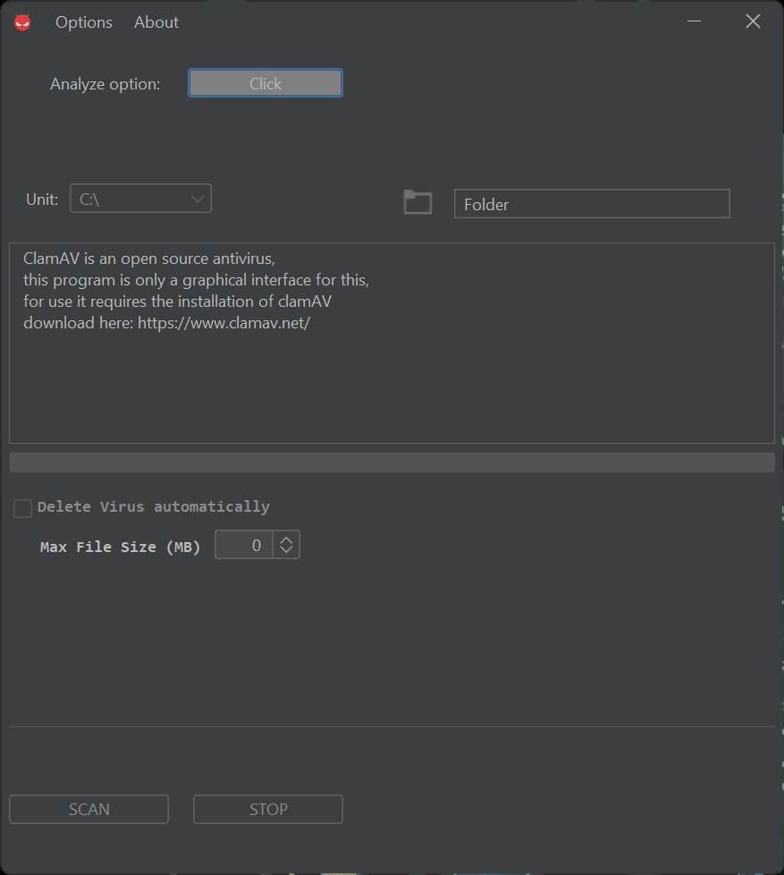

# ClamAV GUI

## Description
- ClamAV GUI is an interface for the use of ClamAV software, it feeds on ClamAV commands to perform basic and simple scans of Windows operating system.

  

### Features
- Scan by unit or route.
- Option to select the maximum size of files in MB.
- Option to remove the virus automatically.
- Automated one-click ClamAV database creation.
- ClamAV database update in one click.
- A log of scans performed.

### Requirements
- Install Java 21 or later. [link](https://www.java.com/)
- Windows 10 or later.
- Install ClamAV. [link](https://www.clamav.net/) DEFAULT DIRECTORY
- I recommend a computer with at least 8GB RAM.

### Installation
- Install the .exe file [link](https://github.com/CodeForUsers/Proyecto-GUI-ClamAV/raw/refs/heads/main/Install/Interface_ClamAV2.0_build101224.exe)
- Run as administrator.
- Once installed, options < create database and update database.

## VERSIONS
ACTUAL 2.0 - 101224
- First public release.

### License
- This work © 2024 by BlueFox is licensed under CC BY-NC 4.0

Sorry in advance for possible mistakes, this is my first project here. :smile:

